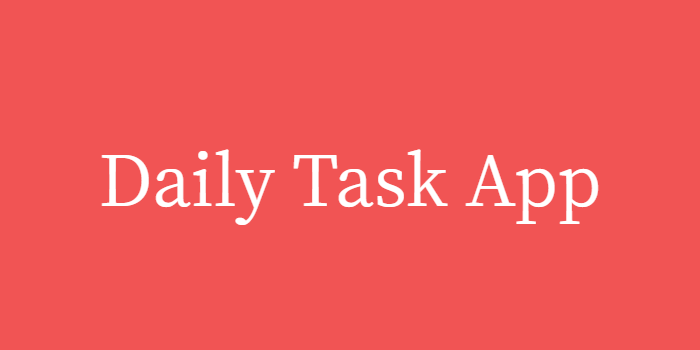
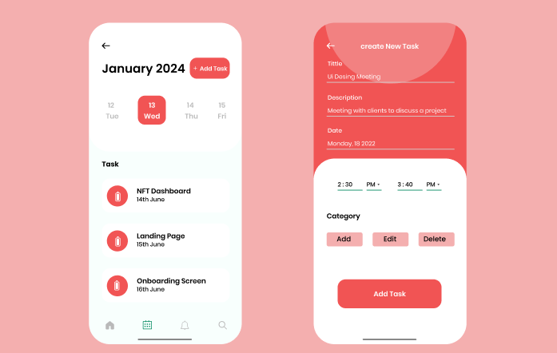

# Overview #

 We created this app because we all volunterred our time to Chingu. Chingu is a remote collaboration community for like-minded developers to make projects in a team setting. We submitted a project to be reviewed for the program. After Jim Medlock and his team looked over our projects it was decided that we were going to be in Voyage 47 tier 1 team 06. This tier is for beginners and you can work your way up to tier 3. Once we found out that we were working together Jim gave us information on our GitHub that he created for us and his expectations of the project. We broke into seperate groups, one group for HTML and CSS which Maya and Peaches were in and Ki and Amy worked on the Javascript portion of the app. We spent 6 weeks collectivly working on developing our app.

# Features #

1. With this app you can choose a specfic day, time and month to input your task 
2. There's mutiple detailed descriptions you can choose from 
3. You can repeat a task every Sunday-Saturday and 1st-31st within a picked timeframe 
4. You can cancel or edit your task 
5. When you're done with your task there is a "done" check box you can choose to show that the task is complete. If you accidently hit the "done" button you can deselect at any time  
6. You can delete a task if you don't need it anymore 
7. The task will display on the landing page once complete  
8. You can click on any date to see if there's a task, the cool thing about this is that a dot shows up on the days you have something to do so you don't have to scroll through all the dates to see what task is coming up  
9. All tasks shown are ordered by priority. If the task priority is the same, the task with the earlier start time will be shown first  

# Tech Used/Dependencies #
This is a basic HTML/CSS/Javascript App

Add-on packages include:

[Bootstrap](https://getbootstrap.com/docs/4.0/getting-started/introduction/)  
[Daily Task Logo](https://banner.godori.dev/)  
[Figma](https://www.figma.com/)

# Running the project #

1. Clone project 
2. Install bootstrap npm install bootstrap (check in package-json in the dependencies section to see if it downloaded properly)  
3. create a index.html, style.css and App.javascript(js) file 
4. If you don't have "open with live server" you can install that on the right hand side of Visual Studio Code click the "extenstions" logo, search for open with live server and install it. You then right click on your mouse "open with live server" and you can see the changes you made in action  
5. I suggest to type "Hello World" with basic CSS like changing the header to be blue (or a color of your choice to see if your app is working) 
6. Now that you have your app up and running you can start coding! 

# Inspiration #

Peaches created this fimga as a blueprint for the app. We used this model to create everything we needed to display on this app. We added extra features like subcategories, a priorites list and a repeat option because that's what the instructions asked for to make the app more cohesive and fluid. 

# Contributors #
Karolina Reichmann karolina@reichmann.pl (Proctor) 
Amy Vier  
Peaches Stitts [LinkedIn](https://www.linkedin.com/in/chawntel-stitts-143780157/)  
Maya Powers  
Ki discord username- kiki2551

